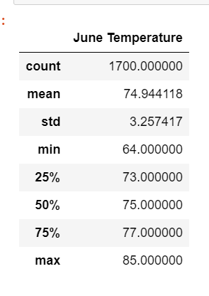

# surfs_up

## Overview
Conducting analysis on weather dataset provided in SQLite database using SQLAlchemy. Purpose of the analysis is to show investor regarding the temperature data for month June an dDecember.  

## Result 
- From the June and December summary, the average temperature is only 4 degree difference. 
- The Minimum temperature between the 2 month is  8 degrees apart
- The Maximum temperature between the 2 month is 2 degrees apart
- the statndard deviation is only 0.5 difference, fairly small. 

 
  

## Summary
The differece of the temparature for mean, min, and max are similar for the two month. 
It could be good to do additional analysis on wind, precipitation statistics of the whether facts to help with the decision where to put the business in the right location
